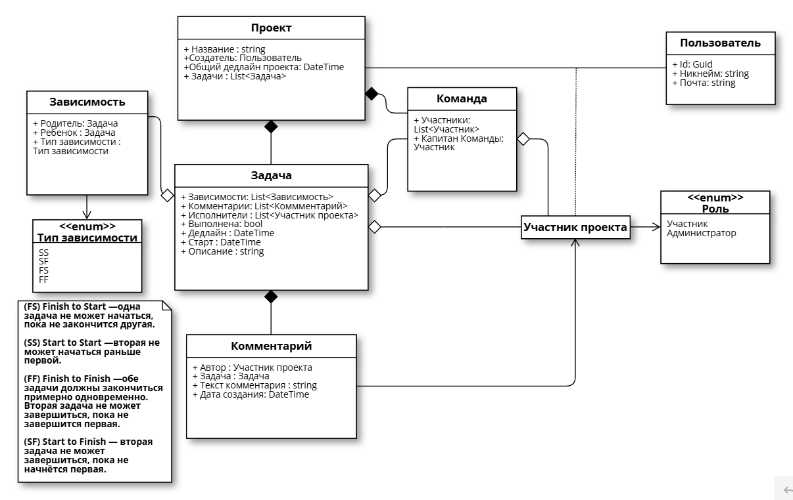
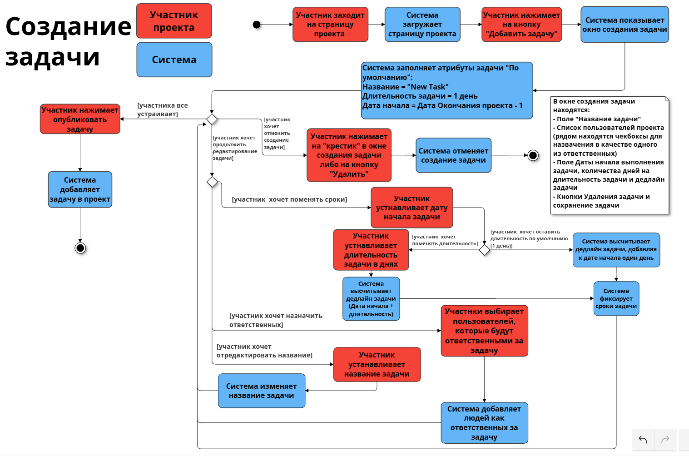
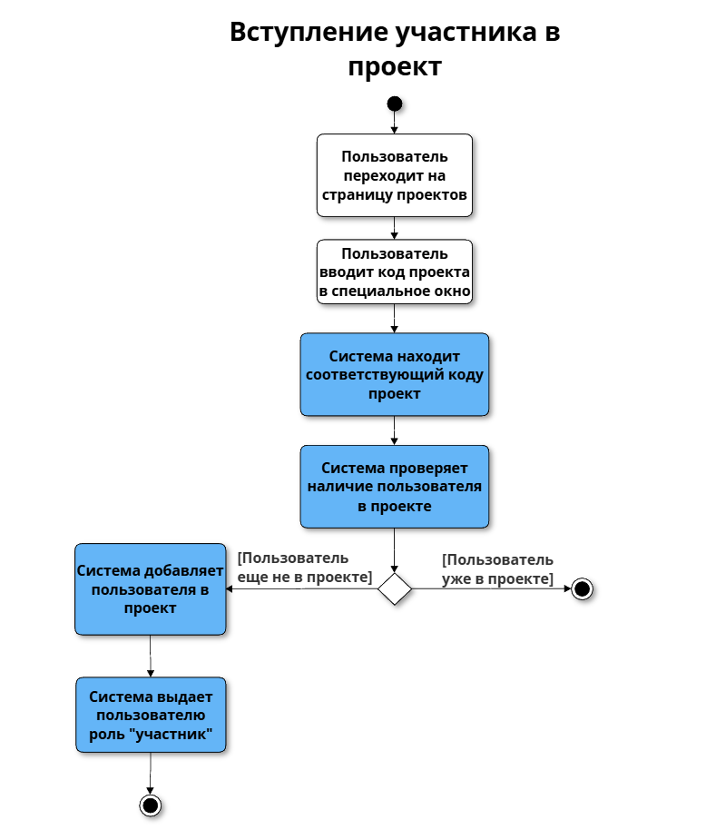
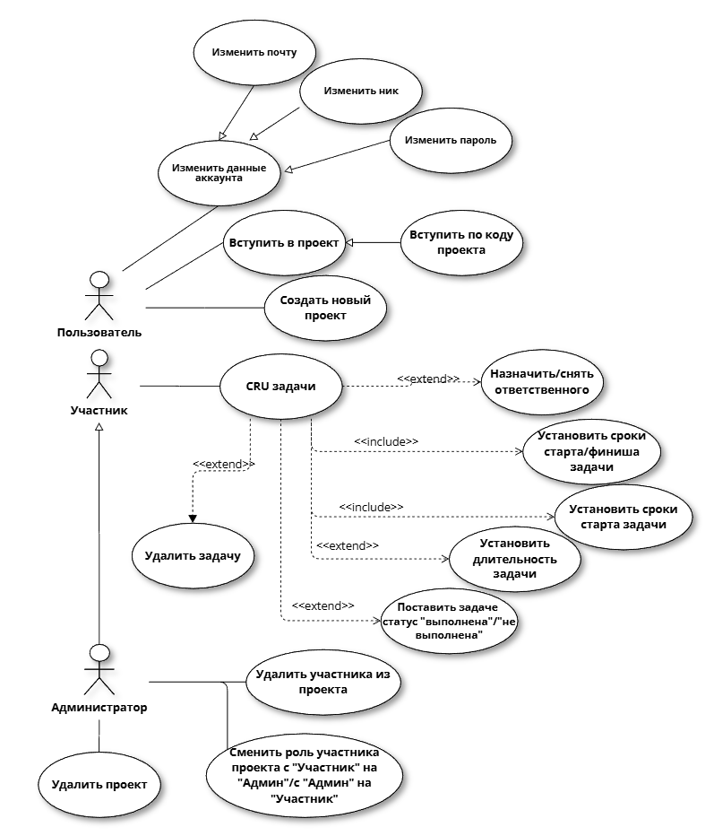

# Gantt-Chart-Backend

## Эндпоинты ProjectsController

**Требование:** Все запросы требуют авторизации (JWT)

### Основные операции с проектами:
- `POST /api/projects` - Создание нового проекта
- `GET /api/projects/{projectId}` - Получение полной информации о проекте
- `PATCH /api/projects/{projectId}` - Обновление данных проекта
- `DELETE /api/projects/{projectId}` - Удаление проекта

### Управление корневой задачей проекта:
- `PATCH /api/projects/{projectId}/root?taskId={taskId}` - Установка корневой задачи проекта

### Управление участниками проекта:
- `POST /api/projects/{projectId}/members?userId={userId}` - Добавление пользователя в проект
- `DELETE /api/projects/{projectId}/members/{userId}` - Удаление пользователя из проекта
- `PATCH /api/projects/{projectId}/members/{userId}` - Изменение роли пользователя в проекте

## Эндпоинты ProjectStuffController (Team)

**Требование:** Все запросы требуют авторизации (JWT)

### Основные операции с командами:
- `POST /api/teams` - Создание новой команды
- `POST /api/teams/{teamId}/{memberId}` - Добавление участника в команду
- `DELETE /api/teams/{teamId}/{memberId}` - Удаление участника из команды

## Эндпоинты TaskController

**Требование:** Все запросы требуют авторизации (JWT)

### Основные операции с задачами:
- `POST /api/tasks` - Создание новой задачи
- `GET /api/tasks/{taskId}` - Получение информации о задаче
- `PATCH /api/tasks/{taskId}` - Обновление данных задачи
- `DELETE /api/tasks/{taskId}` - Удаление задачи

### Управление зависимостями задач:
- `POST /api/tasks/{taskId}/dependence` - Добавление зависимости между задачами
- `DELETE /api/tasks/{taskId}/dependence` - Удаление зависимости между задачами

### Управление исполнителями:
- `POST /api/tasks/{taskId}/performers?userId={userId}` - Добавление исполнителя к задаче
- `DELETE /api/tasks/{taskId}/performers?userId={userId}` - Удаление исполнителя из задачи

## Эндпоинты UsersController

### Операции с пользователями:
- `POST /api/users` - Регистрация нового пользователя
- `GET /api/users` - Аутентификация (логин) пользователя
- `GET /api/users/{userId}` - Получение информации о пользователе

**Примечание:**
- Регистрация и логин не требуют авторизации
- При успешном логине устанавливается JWT токен в cookies

### Особенности аутентификации:
- При успешной аутентификации устанавливается cookie с именем "jwt-token"
- Все защищенные эндпоинты автоматически проверяют JWT токен из cookie или заголовка Authorization
